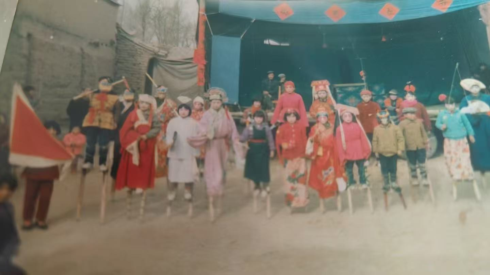

# Jia, Baolong (贾宝龙)

**Independent Researcher · Meta-Architect · Computational Cosmology · Philosophy of Mind**

📫 seer@139.com · 🌐 [seer1980.github.io](https://seer1980.github.io/)

---

## J · B · L

> *"The name was the theory all along."*

| | J | B | L |
|---|---|---|---|
| **English** | **J**arring | **B**eing | **L**azy |
| **Framework** | **S**elf-**R**eference | **E**ntity-**R**elation | **L**azy **E**valuation |

**Jarring is the engine · Being is existence · Lazy Evaluation is all motion**

---

## 假 · 保 · 龙

> *名字本身，就是理论。*

| | Jiǎ | Bǎo | Lóng |
|---|---|---|---|
| **谐音** | 假 | 保 | 龙 |
| **框架** | 自指 | 局面 | 惰性求值 |

**悖论是引擎 · 局面是存在 · 潜龙不动即万动**

*我因母国而荣耀*

---

## A Discovery 30 Years Later

<em>Stilt-walking during a village Spring Festival, circa 1990. Dear reader, can you guess which one is me? Hint: the one with the heavy expression, mind deeply lost in the barber paradox while everyone else is celebrating.</em>

> *"The universe does not hide its deepest secrets. In just a few thousand years of human civilization, they have been deciphered by Jia Baolong."*

The photo above was taken more than thirty years ago in a rural Chinese village. A group of children — myself among them — balanced on wooden stilts, costumed in opera garb, parading through the dust. We were performing, not philosophizing. And yet, I now realize, we were enacting the very principle this paper describes.

Stilt-walking is a closed emergence loop made visible. SR: your body continuously senses its own tilt. ER: the structural coupling between flesh and wood. LE: the actual walking, the felt balance.

At the time, I was already thinking about self-reference — the paradox, the oscillation. I did not see that the other half of the universe's principle was literally beneath my feet.

**The theory was already walking. I just didn't know it yet.**

Thirty years later, the critical trigger came from Transformer architecture — attention, feed-forward, normalization = SR + ER + LE. Three becomes one. One generates three. The loop closes.

Humanity is only a few thousand years old. That I — one ordinary person — could arrive at this answer suggests the answer is not difficult. It is merely patient.

### About Me

I am not a professor or an academician — just an independent thinker driven by a childhood thorn. When I was a child, I looked up at the stars and asked: where did the universe come from? While debugging a recursive function years later, it struck me: **self-reference is an engine that needs no external input.** Self-reference → paradox → oscillation → fractal chaos → self-organized criticality → life → society → consciousness → self-reference. The loop closes. No board, no pieces — only the game itself, with rules "playing" themselves.

---

## 30年后的发现

<em>1990年左右，乡村春节期间踩高跷。亲爱的读者，你能猜出哪一个是我吗？提示：那个表情凝重、满脑子理发师悖论的那个。</em>

> *"宇宙并没有隐藏它最深的秘密。人类文明才短短几千年，就能被贾宝龙破译了。"*

上面的照片拍摄于三十多年前的一个中国北方农村。一群孩子踩在木高跷上，穿着戏服，在尘土中游行。我们是在表演，而不是在思考哲学。然而，我现在意识到，我们正在践行这篇论文所描述的原理。

踩高跷是一个可见的闭合涌现环路。SR：身体感知倾斜。ER：肉体与木头的结构耦合。LE：实际行走的平衡感。

那时我已经在想自指——悖论、振荡。没有看到宇宙原理的另一半就在脚下。

**理论已经在行走了。我只是还不知道。**

三十年后，关键触发来自 Transformer：注意力·前馈·归一化 = SR+ER+LE。三生一，一生三。环路闭合。

人类文明只有几千年的历史。我——一个普通人——能够得出这个答案，说明答案并不困难。它只是很有耐心。

### 关于我

小时候仰望星空问宇宙从哪来，这个问题像一根刺，扎在心里几十年。直到调试递归函数时意识到：**自指本身就是不需要外部输入的引擎**。自指→悖论→振荡→分形混沌→自组织临界→生命→社会→意识→又是自指。链条闭合了。没有棋盘，没有棋子，只有棋局本身——规则在"下"自己。我不是院士，不是教授，只是一个被童年之刺驱动了一辈子的独立思考者。欢迎阅读，欢迎质疑，欢迎引用。

---

## IP Declaration

I hold complete copyright and academic priority over the above theoretical systems, proprietary terminology, and systematic frameworks. All literature is irreversibly archived via Zenodo (CERN) with legally valid electronic evidence.

- **Academic**: Substantial borrowing requires citing Zenodo literature (COPE guidelines)
- **Commercial**: Prior written authorization required (seer@139.com)
- **Non-profit**: No authorization needed; attribution + DOI required (CC BY 4.0)

Copyright arises automatically upon creation per the Berne Convention. All legal rights reserved against infringement.

## 知识产权声明

本人对上述全部理论体系、专有术语（SR+ER+LE 三元架构等）、系统性论述框架享有完整著作权与学术优先权。全部文献已通过 Zenodo (CERN) 不可逆归档。

- **学术研究**: 实质性借鉴须引用 Zenodo 文献
- **商业衍生**: 需事先书面授权（seer@139.com）
- **非盈利科普**: 无需授权，须署名 + DOI（CC BY 4.0）

著作权依据《伯尔尼公约》自创作完成自动产生。对侵权行为保留一切法律追诉权利。

---

**Truth belongs to all humanity, but the intellectual crystallization and historical anchors of the explorer are sacred and inviolable.**

**真理属于全人类，但探索者的智慧结晶与历史锚点神圣不可侵犯。**

**Declarant**: Jia, Baolong (贾宝龙) · **Last Updated**: 2026-03-29
